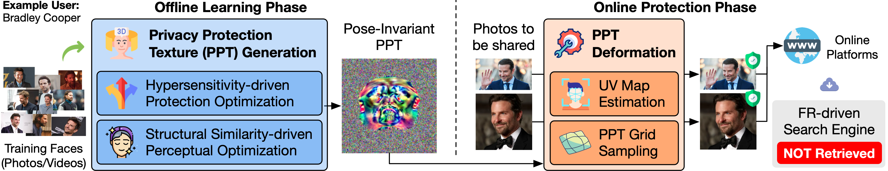

# [CVPR2026 & [CVPR Compute Gold Star](https://cvpr.thecvf.com/Conferences/2026/ComputeReporting)]Protego: User-Centric Pose-Invariant Privacy Protection Against Face Recognition-Induced Digital Footprint Exposure

## Introduction



**Abstract**: Face recognition (FR) technologies are increasingly used to power large-scale image retrieval systems, raising serious privacy concerns. Services like Clearview AI and PimEyes allow anyone to upload a facial photo and retrieve a large amount of online content associated with that person. This not only enables identity inference but also exposes their digital footprint, such as social media activity, private photos, and news reports, often without their consent. In response to this emerging threat, we propose **Protego**, a user-centric privacy protection method that safeguards facial images from such retrieval-based privacy intrusions. Protego encapsulates a user’s 3D facial signatures into a pose-invariant 2D representation, which is dynamically deformed into a natural-looking 3D mask tailored to the pose and expression of any facial image of the user, and applied prior to online sharing. Motivated by a critical limitation of existing methods, Protego amplifies the sensitivity of FR models so that protected images cannot be matched even among themselves. Experiments show that Protego significantly reduces retrieval accuracy across a wide range of black-box FR models and performs at least 2→ better than existing methods. It also offers unprecedented visual coherence, particularly in video settings where consistency and natural appearance are essential Overall, Protego contributes to the fight against the misuse of FR for mass surveillance and identity tracing.

**Example**: We extract a frame from an interview video of Bradley Cooper and submit it to two platforms: (i) PimEyes, a well-known face search engine, and (ii) Google Images. The search is performed both with and without applying Protego's protection.

* [Left] Without protection, both platforms successfully identify Bradley Cooper and even retrieve the exact interview video available online.
* [Right] With Protego applied, neither PimEyes nor Google Images is able to find any matches.

The original video and its protected versions using three different methods (Protego: CVPR'26, Chameleon: ECCV'24, OPOM: TPAMI'22) are shown below. Please note that the GIFs may take a moment to load.


* ***Protego (Ours, CVPR'26)***


* Chameleon (ECCV'24)


* OPOM (TPAMI'22)


For more technical details and experimental results, we invite you to check out [our paper](https://openaccess.thecvf.com/content/CVPR2026/papers/Wang_Protego_User-Centric_Pose-Invariant_Privacy_Protection_Against_Face_Recognition-Induced_Digital_Footprint_CVPR_2026_paper.pdf):

**Ziling Wang, Shuya Yang, Jialin Lu, and Ka-Ho Chow,** *"Protego: User-Centric Pose-Invariant Privacy Protection Against Face Recognition-Induced Digital Footprint Exposure,"*  IEEE/CVF Conference on Computer Vision and Pattern Recognition (CVPR), Denver, CO, USA, Jun. 3-7, 2026.

```bibtext
@inproceedings{wang2026protego,
    title={Protego: User-Centric Pose-Invariant Privacy Protection Against Face Recognition-Induced Digital Footprint Exposure},
    author={Ziling Wang and Shuya Yang and Jialin Lu and Ka-Ho Chow},
    booktitle={Proceedings of the IEEE/CVF Conference on Computer Vision and Pattern Recognition},
    year={2026}
}
```

---

This repository contains the full source code for Protego: training a Privacy Protection Texture (PPT) for a user, applying it to images and videos, and evaluating the protection performance via retrieval recall rates before and after protection.

## Hardware & OS Requirements

The current version of Protego is not optimized for performance, so there may be OOM issues on low-memory devices. For reference, you need around **8 GB of (GPU) memory**. The code has been tested on the following platforms:

* Ubuntu 22.04; Intel Xeon w5-3415 CPU; 1 NVIDIA RTX 5880 Ada GPU (48 GB); 128 GB RAM
* Ubuntu 22.04; AMD EPYC 9354 CPU; 1 NVIDIA RTX 5880 GPU (48 GB); 256 GB RAM
* Ubuntu 22.04; AMD EPYC 9354 CPU; 1 NVIDIA RTX 4090 GPU (24 GB); 256 GB RAM
* Ubuntu 22.04; Intel(R) Xeon(R) Silver 4108 CPU; 1 NVIDIA RTX 3090 GPU (24 GB); 128 GB RAM
* Ubuntu 22.04; Intel(R) Xeon(R) Silver 4108 CPU; 1 NVIDIA RTX 4080 GPU (16 GB); 128 GB RAM
* macOS 15.6.1; Apple M4 Pro; 24 GB Memory
* macOS 15.6.1; Apple M4; 16 GB Memory

Linux + CUDA is the primary, recommended setup. macOS (MPS) is supported but slower and less stable, mostly because of PyTorch and PyTorch3D's immature MPS support — prefer CPU-only or CUDA for stability/performance. Windows users may need to figure out the setup (especially PyTorch3D) themselves; best-effort support only.

## Quick Start

0. Clone this repository:

   ```bash
   git clone --depth 1 https://github.com/HKU-TASR/Protego.git
   cd Protego
   ```

1. Set up the environment and download the essential assets. Run this from the **base** conda environment; the script branches automatically on platform:

   ```bash
   conda activate && bash setup_quick.sh
   conda activate protego
   ```

   *The above installation includes downloading the [FLAME](https://flame.is.tue.mpg.de/) model. This requires registration. If you do not have an account you can register at [https://flame.is.tue.mpg.de/](https://flame.is.tue.mpg.de/). You will be prompted to log in during the download process.*

2. Launch the inference/eval demo notebook `protego.ipynb` and try out the pretrained PPT for Bradley Cooper. In VS Code, select the `protego` kernel; otherwise:

   ```bash
   conda activate protego
   conda install jupyter -y
   jupyter notebook
   ```

## Usage

### Train and evaluate a PPT

#### Prepare the training data

To train your own PPT for a protectee, whose name is `<protectee>`, place a folder of their facial images under `face_db/<your_dataset_name>/<protectee>/`. The final dataset structure should look like this:

```plaintext
face_db/
└── <your_dataset_name>/
    ├── <protectee_1>/
    │   ├── img1.jpg
    │   ├── img2.jpg
    │   └── ...
    ├── <protectee_2>/
    │   ├── img1.jpg
    │   ├── img2.jpg
    │   └── ...
    └── ...
```

The more images and the more diverse the poses/expressions, the better. The images can be cropped or uncropped. However, if the images are uncropped, you will need to set `need_cropping` to `True` tell the code to detect, crop, and throw out unusable images.

#### Start training

`train.py` is the single train/eval entry point. It trains a PPT for every protectee found under `face_db/<your_dataset_name>/`, then runs the cross-protectee retrieval evaluation.

```bash
python train.py --exp_name my_experiment --device cuda:0
```

See `train.py` for more configuration options. Remember to change [this line](./train.py#L78) in `train.py` to point to your own training dataset:

```python
train_data_path = os.path.join(BASE_PATH, 'face_db', '<your_dataset_name>')
```

The trained PPTs will be saved to `experiments/my_experiment/<protectee>/univ_mask.npy`.

#### Evaluate the trained PPT

The training script automatically evaluates the trained PPTs on the preprocessed FaceScrub subset. To run the evaluation separately, switch `train.py` to the eval mode (comment [`run(cfgs, mode='train', data=data, train=train_protego_mask)`](./train.py#L93), uncomment [`run(cfgs, mode='eval', data=data)`](./train.py#L96) and set [`mask_name`](./train.py#L59) to `['my_experiment', 'univ_mask.npy']`).

```bash
python train.py --exp_name my_eval_experiment --device cuda:0
```

### Protect images / videos with a trained PPT

To apply a trained PPT to the images or videos of a protectee named `<protectee>`, place their images or videos under `face_db/imgs/<protectee>/` / `face_db/vids/<protectee>/` and run the corresponding script:

```bash
python -m tools.protect_imgs   # protect a folder of images
python -m tools.protect_vids   # protect a video
```

Edit the configuration block at the top of each script (protectee name, source/destination paths, mask name, `epsilon`, etc.). Both resolve paths relative to the repository root, so no machine-specific paths are required.

## Acknowledgements

The code and weights in the following folders are adapted from existing open-source projects:

* [smirk/](https://github.com/georgeretsi/smirk)
* [FD_DB/MTCNN/](https://github.com/Michael-wzl/mtcnn_pytorch)
* [FD_DB/Retinaface/](https://github.com/biubug6/Pytorch_Retinaface)
* [FR_DB/adaface/](https://github.com/mk-minchul/AdaFace)
* [FR_DB/arcface/](https://github.com/bubbliiiing/arcface-pytorch)
* [FR_DB/facenet/](https://github.com/timesler/facenet-pytorch)
* [FR_DB/ir50_opom/](https://github.com/zhongyy/OPOM)
* [FR_DB/magface/](https://github.com/IrvingMeng/MagFace)
* [FR_DB/vit/](https://github.com/zhongyy/Face-Transformer)
